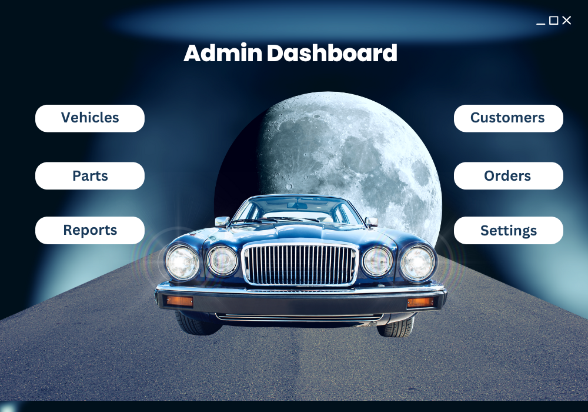
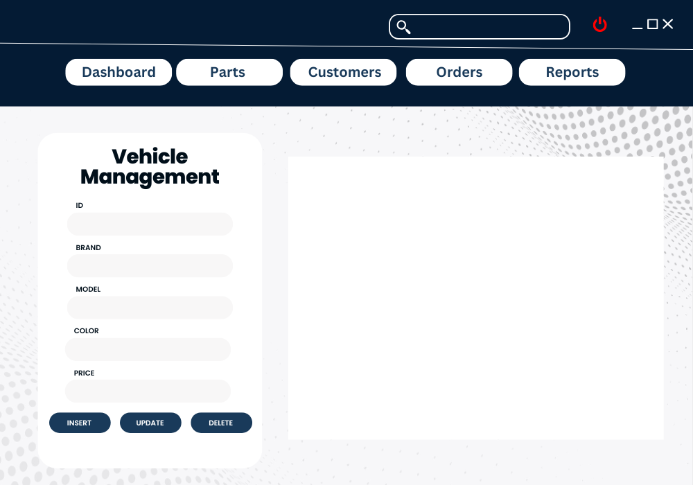
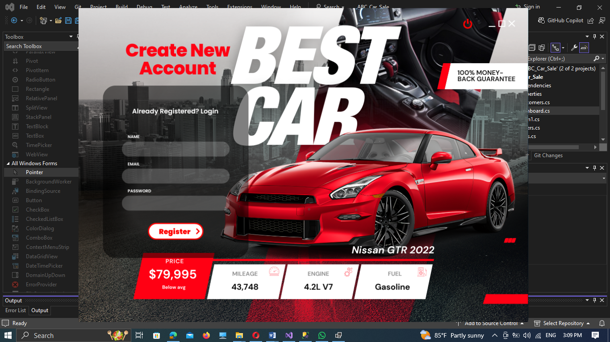
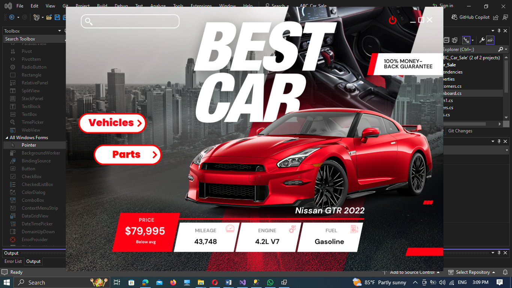
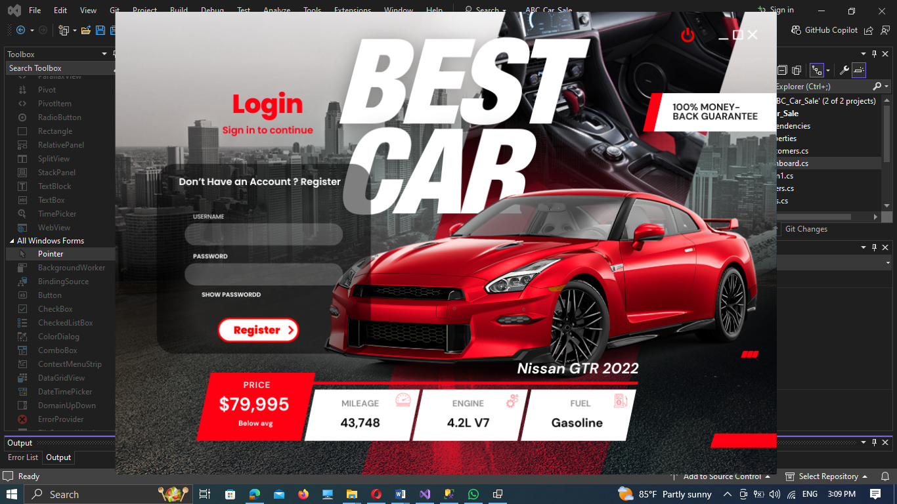
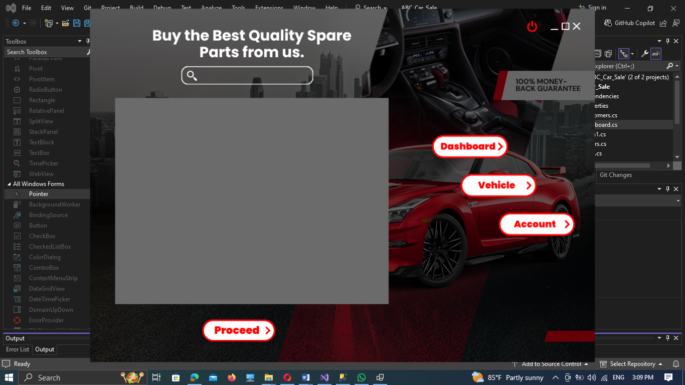
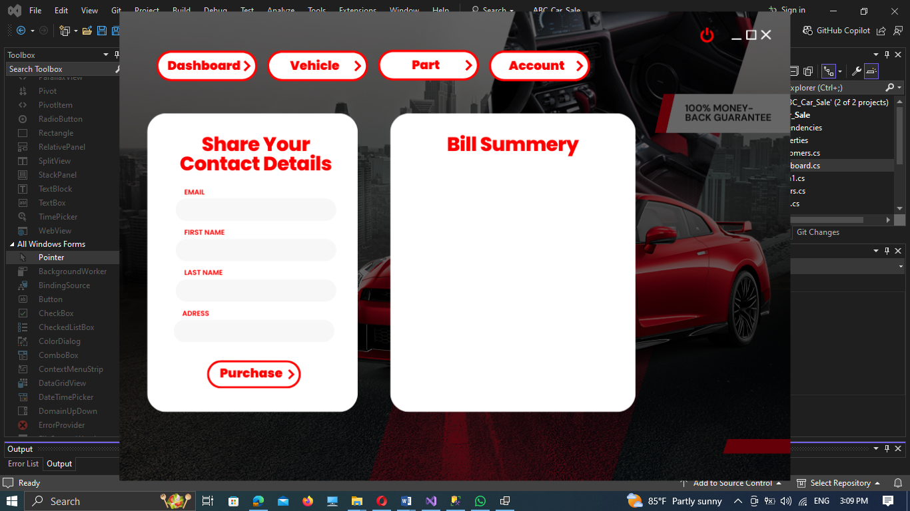

# 🚗 ABC Car Traders

**ABC Car Traders** is a C# application developed as part of the  Application Development module. The system includes features for both administrators and customers, offering complete management of vehicles, parts, and orders through a user-friendly Windows Forms interface connected to a SQL Server database.

---

## 📁 Project Structure

- **Language & Tools**:  
  - C# (.NET Framework)
  - SQL Server Management Studio (SSMS)
  - Visual Studio 2022
  - Crystal Reports (for reporting)
  
- **Modules**:
  - Admin Module
    - Vehicle Management
    - Parts Management
    - Order Management
    - Reporting & CRUD operations
  - Customer Module
    - Register & Login
    - Shop Page (Vehicles & Parts)
    - Checkout Page
    - View Purchase History

---

## 🧩 Features

### 🛠 Admin Side:
- Dashboard to manage core entities
- Add, update, delete, search for vehicles and parts
- View orders and generate reports
- Modern UI with custom controls and images

### 👤 Customer Side:
- Secure registration and login system
- Dashboard with separate sections for car and parts shopping
- View vehicle/part details and proceed to checkout
- Save and view purchase history

---
## 🖼️ UI Preview











## 🗃 Database

- **Database:** SQL Server
- **Tables:**
  - `Customers`
  - `Admins`
  - `Vehicles`
  - `Parts`
  - `Orders`

---

## 📊 Reports

- Order reports can be generated using **Crystal Reports**.
- Reports include total orders, filter by date, and customer details.

---

## 🧪 How to Run

1. Clone the repository:
   ```bash
   git clone https://github.com/nishan-gamage/ABC-Car-Traders.git
